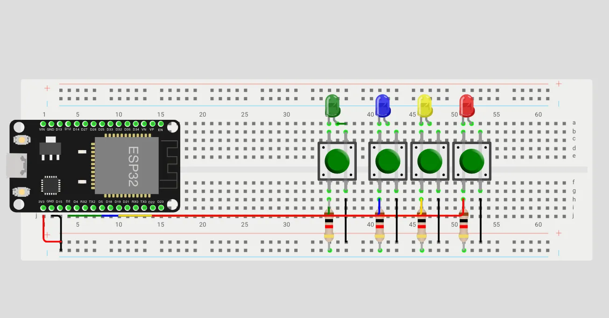

# Logbook

## Day 1:

### Setting up project

Discussed design principles, project structure , role allocation and broke down tasks.

We set up a Github Project as our management tool, created the repository and added the broken down tasks to the board that were then allocated in the team.

Development environement, required libraries, interfaces/types and physical product was designed first in Wokwi (\*\* check image in bottom) and then later on actual hardware that was then tested to ensure expected behaviour

### Development start

We added our overall structure to the project - I.e interfaces and helper methods.

Added some simple functionality to expand upon for the required features, we basically
wanted to register the buttons based on our interface and relevant values to test that each button press would light the correct diode, register the correct time in the correct format all with the correct value corresponding to the buttons id. Our primary focus were expand- and scalability hence the dynamic loading that allowed us to add and adjust the amount of hardware on the board. This way we could check one button and know that future issues with registration would be due to faulty hardware.

```cpp
public:
    Smiley() {}
    Smiley(int button_id, SmileyType type, int light_id)
        : button_id(button_id), type(type), light_id(light_id) {}

    int getButtonId() const { return button_id; }
    SmileyType getType() const { return type; }
    int getLightId() const { return light_id; }
    struct tm* getTimestamp() const { return timestamp; }
    void setTimestamp(struct tm* new_timestamp) { timestamp = new_timestamp; }

private:
    int button_id;
    SmileyType type;
    int light_id;
    struct tm* timestamp;
};

```

Read documentation for required features and started implementation of deep-sleep, WiFi and NTP.

```cpp
#pragma once
class APService
{
public:
    static void setup();
    static void Disconnect();
    static bool isConnected();
};

```

```cpp
class NTPService
{
public:
    static void setup();
    static struct tm* getTime();
};
```

Updated the project board, with tasks and allocated focus areas to read up on for next development day.

## Day 2:

Started work on deep-sleep implementation and tested different optimization approaches, experimented with EzButton, but ended up using more simple behaviour for the registration of button.

Deep-sleep got implemented with a bitmask based on our getButtonId method that takes our defined Buttons registered pins integer, the integer is itterated over and registered as a pin that allows for wake up.

```cpp
  // registers pins used for waking up program
  uint64_t wakeupPins = 0;
  for (Smiley smiley : smiley) {
    wakeupPins |= (1ULL << smiley.getButtonId());
  }
```

We set a cause of wakeup to be EXT1, initially we set the type to be GPIO

Though after testing the type that the wakeup returned was == 3 corrosponding to the type of EXT1.

After a longer testing and debugging phase trying to optimize program execution performance, simplified our code and added an "END" state to our SmileyType enum, which would be reliable in the sense that every type should correspond with a button, which essentially did that we wouldn't calculate the size of our array but relied on the assigned types.  
We settled on a simple approach for button registration, implemented a simple custom debounce and proceeded with tests for ensuring program consistency and reverted some of the dynamic code functionality.

We also tried experimenting with pointers with our ezButton library, but also ended up backtracking for a clearer and more simple approach.

```cpp
struct Debounce {
    int button_id;
    unsigned long last_time;
    Debounce(int id, unsigned long time) : button_id(id), last_time(time) {}

    bool isBounced(int id, unsigned long current_time) {
        if (id != button_id) {
            return false;
        }
        return current_time - last_time <= 50
    }
};
```

We added safe guards for our AP service such that we only create a new connection when one isn't present.

```cpp
  if (!APService::isConnected())
  {
    APService::setup();
    NTPService::setup();
  }
```

Logbook was officially added to the project as [Logfile.md](http://Logfile.md)

## Day 3:

Started with a review of implemented code on main and the project board, we added some new tasks to the board and a column for discarded tasks, this is to ensure a clear overview of explored features and ideas that we have decided not to implement.

In our review of the project structure we focused on edge cases in regards to deep-sleep optimization, specifically, we wanted to explore the possibillities of connection issues due to our deep-sleep strategy and how to handle them without dataloss.

We discussed the possibility of using a queue to store the data that was to be sent, and then send it when the connection was re-established.
the queue would be saved in the deep-sleep memory, and would be sent when the connection was re-established, this would allow us to send the data even if the connection is lost for multiple program runs.

Because of the projects nature, power efficiency is paramount, we wanted to ensure that we can keep the device in deep-sleep as long as possible, and only wake it up when we need to send data. That means that the window for publishing data is very small, leading to possible problems with consistency and reliabillity.

Because of this we also had to consider the use of a wakeup timer which would periodically wake up the device to check for failed messages and send them on a more generous schedule, ensuring that we wont clog the queue in memory.

started working on the MTQQ implementation.

Disscussed different MTQQ libraries and decided to go with the ArduinoMQTT library, as it was the most simple and easy to use.

We added a service class and methods for the MQTT library, and started implementing the basic functionality of connecting to the broker and publishing messages. we also had to reconsider our connection structure for wifi as we needed to ensure that what we had already implemented was optimized for the MQTT library.

```cpp
class MQTTService {
public:
    static void setup();
    static bool sendMessage(const char* message, bool resend = true);
    static bool isConnected();
private:
    static void reSendMessages();
};

```

We did not end up with some refactoring of the APService that would follow the Arduino MQTT library's documentation example.

After the core connection and publish functionality was implemented, we took a look at the message structure and discussed the best approach for the message format. We decided that the message should be sent in a JSON structure, as that would be consistent with how we would pull the data from the database. The format is done without any special libraries, as we wanted to keep the code as simple as possible.

```cpp
    const char* toJson() const {
        static char buffer[256];
        sprintf(buffer,
        "{"
        "\'button_id\': %d, "
        "\'led_id\': %d, "
        "\'type:\': \'%s\', "
        "\'timestamp\': \'%s\'"
        "}", button_id, light_id, SmileyTypeToString(type), asctime(timestamp));
        return buffer;
    }
```

We ended up implementing the discussed queue functionality for failed messages to try and ensure less holes in the program logic, this was implemented as part of the MQTTService class.

The queue is iterated over and checked for failed messages, but is passed quickly if empty to ensure optimised performance.

```cpp
char *failedMessages[5] = (char**)malloc(5 * sizeof(char*));

void MQTTService::reSendMessages()
{

    for (int i = 0; failedMessages[i] != NULL; i++)
    {
        int status = sendMessage(failedMessages[i], false);
        if (status)
        {
            free(failedMessages[i]);
            failedMessages[i] = nullptr;
        }

        delay(200);
    }
}
```

Our implementation of when to resend messages became a rather innovative design, because we wanted to either insert at the next free slot or replace the oldest saved message.

```cpp
        for (int i = 0; i < 5; i++)
        {
            if (failedMessages[i] == nullptr)
            {
                failedMessages[i] = (char *)malloc(strlen(message) + 1);
                strcpy(failedMessages[i], message);
                lastValue = i;
                return false;
            }
        }

        strcpy(failedMessages[++lastValue % 5], message);
```

However, the implementation of replacing the oldest value did not cover all use cases and were therefore refactored into the following for better handling of `lastValue`. We also changed the initialisation of failedmessages to ensure a simpler way of doing the same.

```cpp
char *failedMessages[5] = {nullptr, nullptr, nullptr, nullptr, nullptr};
```

```cpp
        lastValue = (lastValue + 1) % 5;
        if (failedMessages[lastValue] != nullptr)
        {
            free(failedMessages[lastValue]);
        }
        failedMessages[lastValue] = (char *)malloc(strlen(message) + 1);
        strcpy(failedMessages[lastValue], message);
```

We had a minor issue with `\n` in the timestamp, so we had to refactor our `toJson` and ended up with a rather simple approach despite scalability limitations, we concluded it would be a none issue due to the project size.

```cpp
        static char buffer[256];

        std::string s_timestamp (asctime(getTimestamp()));
        s_timestamp.erase(std::remove(s_timestamp.begin(), s_timestamp.end(), '\n'), s_timestamp.end());

        sprintf(buffer,
        "{"
        "\'button_id\': %d, "
        "\'led_id\': %d, "
        "\'type:\': \'%s\', "
        "\'timestamp\': \'%s\'"
        "}", button_id, light_id, SmileyTypeToString(type), s_timestamp.c_str());
        return buffer;
```

After a short debate, we agreed to set the time limit of MQTT to 1.5 seconds, such that it wouldn't run indefinetly.

```cpp
        int count = 0;
        while (!mqttClient.connected())
        {
            Serial.print(".");
            delay(500);
            count++;

            if(count == 3){
                Serial.println("\nERROR: MQTT request timed out");
                return;
            }
        }
```

For the remaining development time we are focusing on tests and debugging.

Our focus were spent on building functionality rather than using libraries. It forced us to have a primitive mindset while still maintaining a rather innovative mindset to solving the problem.

\*\* 
